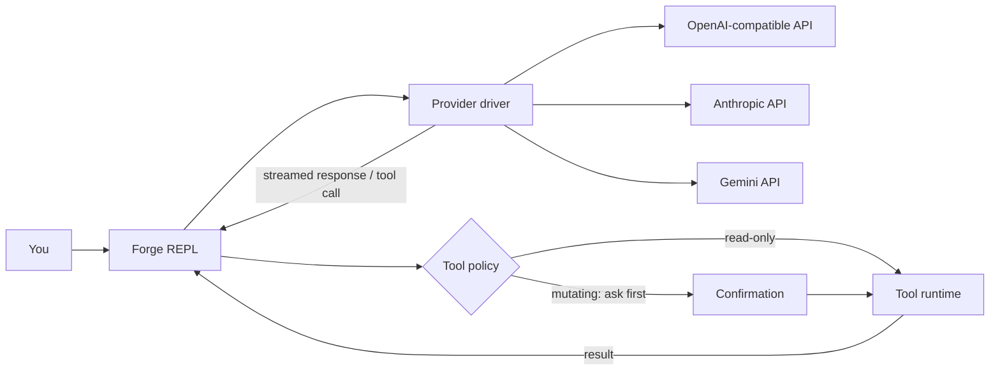

<div align="center">

# 🔥 Forge CLI

### Own your keys. Choose your model. Give your terminal an AI agent.

Forge is a local-first, multi-provider AI command-line agent with streaming chat, file and shell tools, reusable sessions, and token-cost visibility.


</div>

> [!IMPORTANT]
> Forge is currently alpha software. Review every requested tool action before approving it, especially shell commands and file writes.

## Why Forge?

Forge gives you one terminal workflow across multiple AI providers without locking your conversations and tools to a single vendor.

| Benefit | What it means |
| --- | --- |
| **Provider freedom** | Switch between OpenAI-compatible, Anthropic, and Gemini APIs from the same session. |
| **Local control** | Profiles and saved conversations live under your local `~/.forge` directory. |
| **Useful agency** | Let the model inspect projects, search code, edit files, run commands, and fetch web pages. |
| **Human approval** | File mutations and shell execution require confirmation before they run. |
| **Cost awareness** | Track prompt/completion tokens and estimated cost when the provider exposes pricing. |
| **Portable setup** | Use presets or connect any compatible custom endpoint and model ID. |

## Features

- Streaming terminal responses with Markdown-aware rendering and a colorful UI
- OpenAI-compatible, Anthropic Messages, and Gemini GenerateContent drivers
- Multiple named provider profiles with fast provider/model switching
- Eight built-in agent tools for files, search, shell execution, and web content
- Confirmation prompts for mutating tools
- Saved and reloadable local chat sessions
- Token usage and estimated-cost status line
- Interactive model discovery for OpenAI-compatible providers
- TTY-aware input with bracketed-paste support

## Quick start

### Requirements

- Node.js 18 or newer
- npm
- An API key for at least one supported provider

### Install from source

```bash
git clone https://github.com/egdevil1997/forge-cli.git
cd forge-cli
npm install
npm run build
npm link
forge
```

On first launch, Forge opens a setup wizard and stores the selected provider profile locally.

To work on Forge without installing a global command:

```bash
npm install
npm run build
npm start
```

## Provider setup

Forge supports three wire formats:

| Format | Endpoint style | Authentication |
| --- | --- | --- |
| `openai` | `/chat/completions` and optional `/models` | Bearer token |
| `anthropic` | `/messages` | `x-api-key` |
| `gemini` | `/models/{model}:streamGenerateContent` | `x-goog-api-key` |

Built-in presets are provided for Signor and OpenRouter. Choose `custom` in the setup wizard for any compatible endpoint.

Configuration is stored at:

```text
~/.forge/config.json
```

Example shape:

```json
{
  "activeProfile": "openrouter",
  "profiles": {
    "openrouter": {
      "baseURL": "https://openrouter.ai/api/v1",
      "apiKey": "<YOUR_API_KEY>",
      "format": "openai",
      "model": "openrouter/auto"
    }
  }
}
```

> [!WARNING]
> API keys are currently stored in this local JSON file. Forge attempts restrictive file permissions where the platform supports them, but OS keychain integration is planned and recommended before broader production use.

## Slash commands

| Command | Purpose |
| --- | --- |
| `/help` | Show all commands |
| `/provider list` | List configured provider profiles |
| `/provider use <name>` | Switch active profile |
| `/provider add` | Add a custom provider interactively |
| `/model` | Fetch and choose a model |
| `/model <id>` | Set a model directly |
| `/key <profile> <key>` | Update a profile API key |
| `/tools` | List available tools |
| `/clear` | Reset conversation context |
| `/history` | Display conversation history |
| `/save [name]` | Save the current session |
| `/load <name>` | Load a saved session |
| `/sessions` | List saved sessions |
| `/cost` | Display cumulative token usage and estimated cost |
| `/exit` | Quit Forge |

## Agent tools

| Tool | Capability | Approval required? |
| --- | --- | :---: |
| `read_file` | Read a text file | No |
| `list_dir` | List directory entries | No |
| `glob_search` | Find paths using glob patterns | No |
| `grep_search` | Search file contents with a regular expression | No |
| `web_fetch` | Fetch text from a URL | No |
| `write_file` | Create or overwrite a file | **Yes** |
| `edit_file` | Replace one exact text match | **Yes** |
| `bash_exec` | Execute a shell command | **Yes** |

Forge limits tool output and caps each model turn at ten tool iterations. The planned security model adds workspace boundaries, command/network policies, secret redaction, and an audit trail; see [Security](SECURITY.md) and the [Roadmap](ROADMAP.md).

## How it works



Provider-specific request and streaming details stay behind a shared `ChatDriver` interface. The REPL owns conversation state, tool-call iteration, approvals, session persistence, and usage accounting.

## Project structure

```text
forge-cli/
├── bin/                  # npm executable launcher
├── dist/                 # compiled JavaScript
├── docs/                 # architecture decisions
├── src/
│   ├── commands/         # slash-command handling
│   ├── providers/        # OpenAI, Anthropic, and Gemini drivers
│   ├── tools/            # built-in agent tools
│   ├── config.ts         # provider profiles and setup wizard
│   ├── repl.ts           # conversation and tool loop
│   └── session.ts        # local session persistence
├── ROADMAP.md
├── SECURITY.md
└── package.json
```

## Development

```bash
npm install
npm run build
npm start
```

Use watch mode while editing TypeScript:

```bash
npm run dev
```

Before opening a pull request, make sure `npm run build` succeeds. Automated tests, linting, formatting, and CI are high-priority roadmap items.

## Roadmap

The next releases focus on safety and reliability before adding broader autonomy:

1. Workspace-scoped filesystem access and safe path resolution
2. OS keychain-backed credentials and log redaction
3. Command, network, and per-tool permission policies
4. Dry-run diffs, structured audit logs, and undo-friendly changes
5. Automated tests, CI, cancellation, retries, and context management
6. Git-aware tools, patch application, MCP support, and plugin discovery
7. Packaged releases for npm and common operating systems

See [ROADMAP.md](ROADMAP.md) for priorities, trade-offs, milestones, and measurable targets.

## Security

Forge can execute model-requested actions on your machine. Treat model output and fetched web content as untrusted input, inspect approval prompts carefully, and avoid running Forge in sensitive directories until workspace sandboxing lands.

Read [SECURITY.md](SECURITY.md) for the current trust model, known limitations, and vulnerability-reporting guidance.

## Contributing

Issues and pull requests are welcome. For substantial changes, open an issue first and describe the user problem, proposed behavior, security impact, and how the change will be tested.

Please do not publish suspected vulnerabilities in a public issue; follow [SECURITY.md](SECURITY.md) instead.

---

<div align="center">

Built for developers who want model choice, local control, and a terminal-native AI workflow.

</div>
