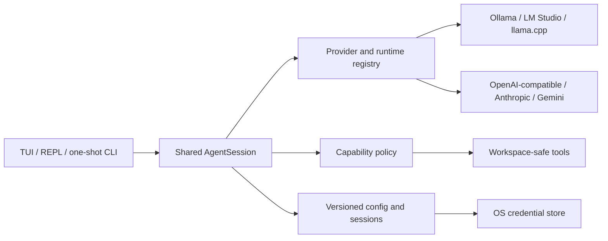

<div align="center">

# Forge CLI

### One terminal agent for cloud APIs and local open-source models.

Forge is a local-first AI coding CLI with a TUI-first workspace, streaming chat, workspace-scoped tools, persistent sessions, permission modes, and first-class support for Ollama, LM Studio, llama.cpp, and OpenAI-compatible runtimes.


</div>

> [!IMPORTANT]
> Forge can modify files and run processes with your account's permissions. Keep the default `balanced` mode, review approval prompts, and use a dedicated workspace for untrusted projects.

## Why Forge?

| Benefit | What it gives you |
| --- | --- |
| Local model freedom | Run downloaded Qwen, Llama, Mistral, Gemma, and other models through supported local runtimes. |
| Provider portability | Use OpenAI-compatible, Anthropic, Gemini, and custom endpoints without changing workflows. |
| Workspace awareness | Load `FORGE.md` or `AGENTS.md`, inspect project metadata, pin files, search code, and review Git state. |
| Layered safety | Canonical path checks, schema-validated tool calls, permission modes, SSRF defenses, atomic writes, and explicit approvals. |
| Scriptable automation | Use interactive chat, a full-screen TUI, or `forge run` with JSON output. |
| Local ownership | Keep configuration, history, and saved sessions under `~/.forge`; remote keys use the OS credential store when available. |

## Install

Requirements: Node.js 22 or newer and npm.

```bash
git clone https://github.com/h3ex0/forge-cli.git
cd forge-cli
npm install
npm run build
npm link
forge
```

The first interactive launch opens the provider setup wizard, then Forge starts its full-screen workspace. For development without a global link:

```bash
npm start
```

## Use a local Qwen model

Ollama is the quickest path. Install Ollama separately, start its service, then run:

```bash
forge model pull ollama:qwen3 --yes
forge model use ollama:qwen3
forge run "Explain this repository" --offline
```

Inside interactive Forge, the equivalent commands are:

```text
/model pull ollama:qwen3
/model use ollama:qwen3
/offline on
```

Forge never downloads a model silently. Pulls require explicit confirmation, and runtime processes are started only through an explicit `runtime start` command. Check the model's license and disk requirements before downloading it.

## Local runtimes

| Runtime | Default endpoint | Discovery | Download support |
| --- | --- | --- | --- |
| Ollama | `http://127.0.0.1:11434/v1` | Native model API | `forge model pull ollama:<model>` |
| LM Studio | `http://127.0.0.1:1234/v1` | OpenAI-compatible API | Uses the installed `lms` command |
| llama.cpp | `http://127.0.0.1:8080/v1` | OpenAI-compatible API | Public `.gguf` URL to Forge's local model directory |
| Generic | `http://127.0.0.1:8000/v1` | OpenAI-compatible API | Managed externally |

Examples:

```bash
forge runtime status
forge model list
forge model info ollama:qwen3
forge runtime start ollama
forge runtime start llamacpp --model-path D:\models\qwen.gguf
forge runtime stop llamacpp
```

Forge only stops runtime processes it previously started.

## Interfaces

```bash
forge                         # default full-screen TUI in a supported terminal
forge chat                    # force the enhanced inline REPL
forge tui                     # explicitly open the full-screen workspace
forge run "Summarize package.json"
forge run "Return a release summary" --json
forge run "Work offline" --model ollama:qwen3 --offline
forge doctor --json
forge limit show
forge completion powershell
```

When input or output is redirected, or the terminal is too small for a safe full-screen layout, plain `forge` falls back to inline mode. This keeps pipes and automation stable.

## Full-screen workspace

The TUI and inline REPL share the same agent engine, tool loop, permission decisions, messages, usage accounting, and cancellation behavior. The responsive layout shows conversation, tool activity, project context, the active model, and session state without taking focus away from the composer.

| Shortcut | Action |
| --- | --- |
| `Ctrl+K` | Search commands |
| `Ctrl+P` | Search workspace files and pin context |
| `Ctrl+M` | Switch cloud profiles or local models |
| `Ctrl+S` | Browse saved and automatic sessions |
| `Ctrl+T` | Toggle mouse capture on or off |
| `Ctrl+Y` | Open the focused pane in the borderless reader |
| `Ctrl+E` | Open full session status or the latest error in the reader |
| `Tab` | Move focus between visible panes |
| `Page Up` / `Page Down` | Scroll conversation history |
| `Ctrl+J` | Insert a newline in the composer |
| `Esc` | Close an overlay or cancel the active turn |
| `Ctrl+C` | Cancel active work; exit when idle |
| `?` | Open help from an empty composer |

Native text selection is the default: drag normally to select and copy terminal text. Press `Ctrl+T` or run `/mouse on` when you want clickable panes, footer actions, overlay rows, wheel scrolling, and approval buttons. Click `[Mouse on]` or press `Ctrl+T` again to return to selection mode. Many terminals also support `Shift+drag` for selection while mouse capture is active.

Because terminals select screen rows rather than UI components, selecting directly across the three-column workspace can include neighboring borders. Focus a pane with `Tab` and press `Ctrl+Y`, or enable mouse mode and click `[Reader]`/right-click a pane. `Ctrl+E` opens the complete session status or latest error directly. Forge replaces the columns with a borderless, full-width view containing only that pane's untruncated text. Mouse capture switches off automatically so you can drag-select cleanly; `Esc` returns to the workspace.

Commands, model names, files, and sessions are searchable inside their overlays. Prompts typed while Forge is working are queued for the next turn. The TUI autosaves conversations as `autosave` and records `recovery-latest` before approved write/process operations.

The inline REPL remains available for classic command output and provider-creation prompts. It includes persistent history, Up/Down navigation, Tab completion, quoted slash-command arguments, and multiline paste support.

## Tokens, cost, and subscription limits

The bottom status line continuously displays prompt, completion, total, and estimated context tokens. Estimated cost appears when model pricing is known.

OpenAI-compatible and Anthropic providers can expose request/token rate limits in response headers. Forge displays those automatically when present. Most providers do not expose account billing subscriptions through chat APIs, so you can configure a local plan label and ceiling:

```bash
forge limit set --name Pro --tokens 1000000 --cost 20 --reset 2026-09-01T00:00:00Z
forge limit show
forge limit reset-usage
forge limit clear
```

Inside Forge:

```text
/limit set 1000000 20 Pro
/limit show
/limit clear
```

Forge keeps a protected local cumulative token ledger per profile and compares it with the configured plan ceiling. `--reset` clears that counter once the specified time arrives; `reset-usage` clears it immediately. Cost is estimated for the current session when pricing is known. These are informational guardrails, not authoritative provider billing data. Forge marks the status line when a configured ceiling is reached.

## Slash commands

| Area | Commands |
| --- | --- |
| Models and providers | `/model list`, `/model use`, `/model info`, `/model pull`, `/provider list`, `/provider use`, `/provider add` |
| Local runtimes | `/runtime list`, `/runtime status`, `/runtime start`, `/runtime stop` |
| Safety and routing | `/mode read-only\|balanced\|autonomous`, `/route manual\|auto`, `/offline on\|off`, `/workspace [path]` |
| Project context | `/instructions`, `/tree`, `/index`, `/context list\|add\|drop\|clear`, `/read`, `/open`, `/search`, `/files`, `/inspect`, `/hash`, `/json`, `/stats` |
| Developer workflow | `/diff`, `/changed`, `/git status\|diff\|log`, `/show`, `/test`, `/build`, `/lint`, `/format`, `/typecheck`, `/check`, `/run`, `/mkdir`, `/copy` |
| Agent workflows | `/review`, `/plan`, `/fix`, `/explain`, `/refactor`, `/testgen`, `/docs`, `/security`, `/summarize` |
| Sessions and UI | `/new`, `/history`, `/save`, `/checkpoint`, `/load`, `/resume`, `/branch`, `/export`, `/sessions`, `/cost`, `/usage`, `/limit`, `/status`, `/doctor`, `/tools`, `/ui`, `/theme`, `/mouse on\|off` |

Run `/help` for the authoritative command list.

`/run` passes the executable and each argument separately, avoiding shell-string interpolation. `/check` discovers available `typecheck`, `lint`, `test`, and `build` scripts and runs them in order, stopping on the first failure. Process and write commands still follow the active permission mode and approval flow.

## Built-in tools and permissions

Forge classifies every tool as `read`, `write`, `process`, `network`, `credential`, or `external` and validates its arguments before execution.

| Mode | Read | Write | Process/network |
| --- | :---: | :---: | :---: |
| `read-only` | Allow | Deny | Deny |
| `balanced` (default) | Allow | Ask | Ask |
| `autonomous` | Allow | Allow | Ask |

The current toolset includes ranged file reads, metadata and SHA-256 inspection, JSON Pointer queries, workspace statistics, atomic writes and exact edits, no-overwrite copying, directory creation, tree/glob/grep search, structured process execution, compatibility shell execution, Git status/diff/log/show, and guarded web fetching. Filesystem tools remain inside the configured workspace after canonical path and link checks. Network tools reject credentials in URLs and private, loopback, link-local, or metadata destinations.

Offline mode removes network tools and refuses cloud-backed one-shot prompts.

## Configuration and credentials

Forge uses a versioned configuration at `~/.forge/config.json`. Existing configurations migrate automatically to schema v5 with the TUI-first, selection-friendly default. Use `Ctrl+T` or `/mouse on` for clickable controls, or `/ui inline` or `forge chat` to retain the classic experience. Remote API keys are stored through the operating-system credential manager when available; headless environments can use:

```text
FORGE_API_KEY_<PROFILE_NAME>
```

Profile names are uppercased and non-alphanumeric characters become underscores. For example, `open-router` maps to `FORGE_API_KEY_OPEN_ROUTER`.

`/key` remains available for compatibility but is deprecated because command arguments can appear in terminal history. Prefer the setup flow, OS credential store, or environment variable.

## Project instructions

Place either file at the workspace root:

```text
FORGE.md
AGENTS.md
```

Forge loads both when present and injects them into the system context. Use `/instructions` to see what was loaded and `/context add <file>` to pin additional files for the current conversation.

## Development

```bash
npm install
npm run verify
```

`npm run verify` type-checks the project, runs the Vitest suite, and rebuilds `dist`. CI performs the same verification on Windows, macOS, and Linux with Node.js 22.

## Architecture



See [ROADMAP.md](ROADMAP.md) for upcoming work and [SECURITY.md](SECURITY.md) for the current trust boundary and vulnerability reporting process.

## Contributing

Issues and pull requests are welcome. Include the user problem, behavior change, security impact, and tests. Report suspected vulnerabilities privately as described in [SECURITY.md](SECURITY.md).

---

<div align="center">

Built for developers who want model choice, local control, and a terminal-native workflow.

</div>
