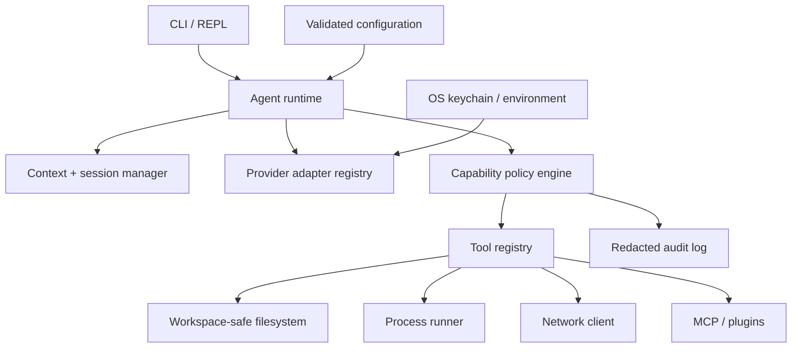

# Forge CLI Roadmap

Forge's roadmap prioritizes safe, dependable local agency before broader autonomy. Dates are intentionally omitted until test coverage and release automation make delivery predictable.

## Product direction

Forge should become a provider-independent terminal agent that is:

- **Local-first:** user-owned configuration, sessions, policies, and audit data.
- **Safe by default:** least privilege, explicit boundaries, and reversible changes.
- **Provider-portable:** one stable agent/tool interface across model vendors.
- **Observable:** users can understand context, actions, tokens, cost, and failures.
- **Extensible:** new providers and tools can be added without changing the REPL core.
- **Cross-platform:** first-class Windows, macOS, and Linux behavior.

## Target architecture

The initial implementation should remain a modular monolith. A plugin boundary is useful; separate services are not. This keeps installation, debugging, and local trust straightforward.

## Non-functional targets

| Area | Initial target |
| --- | --- |
| Safety | No filesystem access outside approved roots after canonical path and symlink resolution |
| Secrets | API keys absent from config, logs, errors, session files, and tool output by default |
| Reliability | Tool cancellation and deterministic timeouts; corrupt config/session errors are recoverable |
| Performance | Startup under 500 ms on a typical developer machine, excluding network model discovery |
| Compatibility | Supported and tested on current Windows, macOS, and Linux with Node.js 18+ |
| Quality | Unit tests for policies/providers; integration tests for the agent loop; smoke tests for the CLI |
| Observability | Structured local audit records with secrets redacted and an opt-out setting |
| Maintainability | Provider and tool contracts versioned and validated at their boundaries |

## Phase 0 — Repository foundation

**Outcome:** contributors can build, test, and release Forge consistently.

- Add Vitest-based unit and integration tests.
- Add ESLint, Prettier, and a single `npm run verify` command.
- Add GitHub Actions for Windows, macOS, and Linux on supported Node versions.
- Add dependency update automation and `npm audit` checks.
- Define semantic versioning, changelog, contribution guide, code of conduct, and license.
- Add npm package metadata, a controlled `files` list, and release provenance.
- Correctly validate documentation commands in CI.

## Phase 1 — Security baseline

**Outcome:** Forge is safe enough for routine use inside an explicitly selected workspace.

### Filesystem layer

- Introduce one canonical workspace root and deny paths outside it by default.
- Resolve real paths before authorization to prevent `..`, junction, and symlink escapes.
- Separate read, create, edit, delete, and metadata capabilities.
- Preview file diffs before approval and use atomic writes with recoverable backups.
- Sanitize session names to prevent path traversal.

### Secrets layer

- Store keys in the OS credential manager; support environment-variable references for headless use.
- Migrate existing plaintext keys with explicit user confirmation.
- Redact secrets from errors, history, saved sessions, tool arguments/results, and audit output.
- Avoid entering keys through visible command arguments such as `/key <profile> <key>`.

### Process layer

- Replace shell-string execution with a structured program/argument runner where possible.
- Add deny rules for destructive commands and protected paths.
- Support `deny`, `ask`, and `allow` decisions per tool, workspace, command, and session.
- Display resolved executable, working directory, environment changes, and timeout before approval.
- Add cancellation, output streaming, output caps, and child-process cleanup.

### Network layer

- Require HTTPS by default and validate URL schemes.
- Block loopback, link-local, private-network, and cloud-metadata targets unless explicitly approved.
- Add domain allowlists, redirect limits, response-size limits, and content-type checks.
- Treat fetched content as untrusted and preserve its provenance in model context.

### Policy and audit layer

- Validate every tool argument against JSON Schema before execution.
- Add a central policy engine instead of a single destructive boolean.
- Record redacted decisions and effects in a structured local audit log.
- Add a `forge doctor` command that reports risky configuration without exposing secrets.

## Phase 2 — Reliability and everyday usability

**Outcome:** long sessions and provider failures are predictable and recoverable.

- Add `Ctrl+C` cancellation for model streams and active tools.
- Add bounded retries with jitter for transient provider failures.
- Validate and version config/session schemas with safe migration and backup.
- Add automatic session recovery and optional autosave.
- Add context-window measurement, compaction, and user-visible truncation warnings.
- Add per-turn token/cost budgets and maximum tool-duration controls.
- Make model discovery available for all provider formats where supported.
- Add non-interactive prompt mode and JSON output for scripting.
- Improve accessibility with `NO_COLOR`, reduced decoration, and stable plain-text output.

## Phase 3 — Developer tools

**Outcome:** Forge handles common repository tasks precisely and with reviewable changes.

| Tool | Benefit | Safety requirement |
| --- | --- | --- |
| `git_status` / `git_diff` | Gives the model exact repository state | Read-only and output-limited |
| `apply_patch` | Makes narrow, reviewable edits | Preview plus workspace enforcement |
| `file_tree` | Provides compact project structure | Ignore rules and depth/size caps |
| `test_runner` | Runs known project test scripts | Script allowlist and timeout |
| `diagnostics` | Surfaces compiler/linter failures structurally | No arbitrary command fallback |
| `http_request` | Calls JSON APIs with structured output | Network policy and secret redaction |
| `git_commit` | Creates user-reviewed commits | Explicit diff review and confirmation |
| `search_web` | Adds discoverability beyond direct URL fetches | Provider disclosure and provenance |

Additional improvements:

- Parallel execution for independent read-only tools with concurrency limits.
- Tool-result caching and deduplication within a turn.
- Standard result envelopes for status, metadata, warnings, and truncation.
- Pluggable tool registry with versioned manifests.

## Phase 4 — Extensibility and provider depth

**Outcome:** the community can add integrations without weakening the core boundary.

- MCP client support behind the same policy engine.
- Signed or checksummed plugin manifests and explicit capability declarations.
- Provider feature negotiation for tools, images, reasoning, and usage metadata.
- Configurable system prompts and reusable project instruction files.
- Model aliases, fallback chains, and provider health checks.
- Optional local-model presets for compatible runtimes.

## Phase 5 — Distribution and ecosystem

**Outcome:** Forge is easy to install, update, and trust.

- Publish a minimal npm package with provenance and reproducible build checks.
- Add standalone binaries or installers for major operating systems.
- Generate release notes and checksums automatically.
- Add shell completions for PowerShell, Bash, Zsh, and Fish.
- Publish a documentation site and provider/tool authoring guides.
- Add opt-in, privacy-preserving diagnostics only after a public data specification.

## Key decisions and trade-offs

| Decision | Benefit | Cost / trade-off |
| --- | --- | --- |
| Security before new autonomy | Reduces risk as tool power grows | Delays some headline features |
| Modular monolith | Simple install and local debugging | Requires disciplined internal interfaces |
| Deny-by-default capabilities | Clear, least-privilege behavior | More prompts until policies are tuned |
| OS keychain with env fallback | Strong interactive and CI workflows | Platform-specific integration work |
| Structured tools over shell strings | Better validation and portability | Cannot express every command directly |
| Local audit trail | Actions are explainable and reviewable | Must be carefully redacted and rotated |

The proposed capability-policy decision is recorded in [ADR-0001](docs/adr/0001-capability-based-tool-policy.md).

## Failure modes and mitigations

| Failure mode | Impact | Mitigation |
| --- | --- | --- |
| Prompt injection requests a dangerous action | Data loss or exfiltration | Capability policy, provenance, previews, explicit approval |
| Malicious path escapes workspace | Reads or modifies unrelated files | Canonical path checks and symlink/junction defense |
| Fetched URL reaches an internal service | SSRF and credential exposure | Network address policy, redirect validation, allowlists |
| Provider stream stops mid-turn | Incomplete conversation/tool state | Cancellation semantics, retry classification, recoverable checkpoints |
| Tool hangs or floods output | Frozen CLI or memory pressure | Deadlines, cancellation, streaming caps, child cleanup |
| Config/session becomes corrupt | Startup failure or history loss | Schema validation, atomic writes, backups, migration tooling |
| Secret appears in output | Credential compromise | Central redaction, secure input, audit tests |
| Plugin is malicious or compromised | Host compromise | Signed manifests, explicit capabilities, isolation, disabled by default |

## Release gates

### v0.2 — Safe workspace

- Workspace boundary and path traversal tests
- Validated tool arguments
- Sanitized session names
- Central permission decisions and diff previews
- CI across all supported operating systems

### v0.3 — Secure credentials and reliable sessions

- OS keychain/environment secret references
- Redaction pipeline and audit log
- Cancellation, retries, schema migrations, and autosave
- Per-turn budgets and context management

### v0.4 — Developer workflow

- Git-aware, patch, diagnostics, and test tools
- Non-interactive/JSON mode
- Stable tool result contracts

### v1.0 — Stable extensible agent

- Stable provider and tool APIs
- MCP/plugin security boundary
- Reproducible, signed releases
- Documented compatibility and migration policy
- No open critical or high-severity security findings
